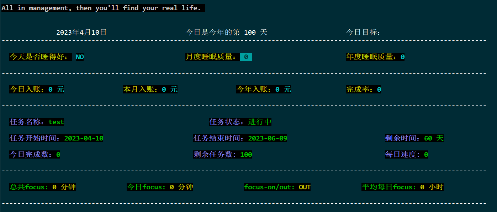
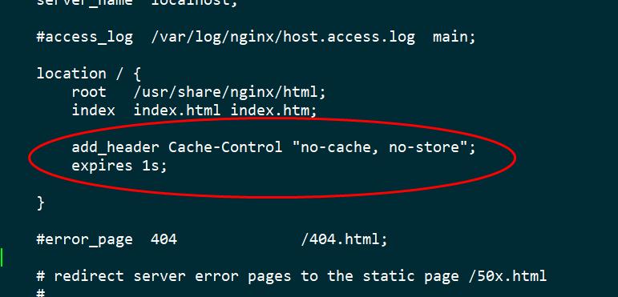
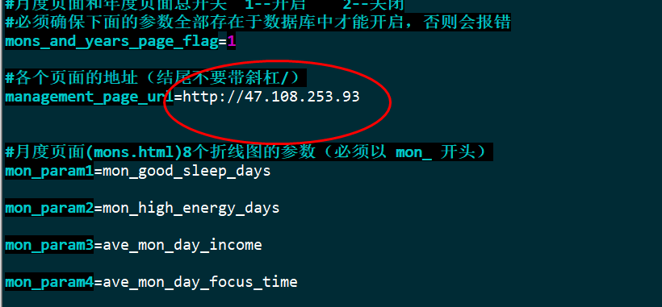
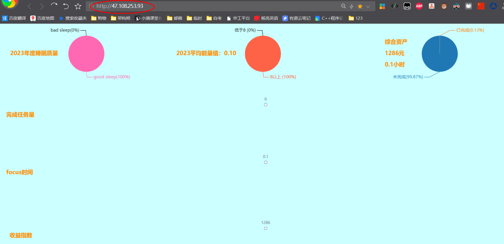
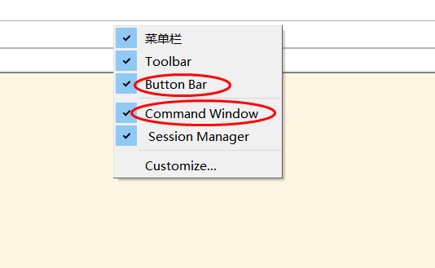
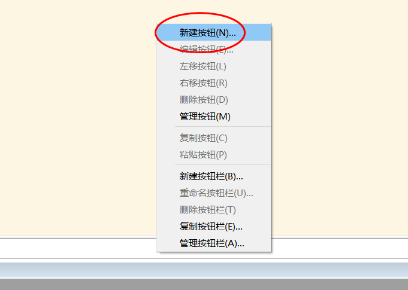
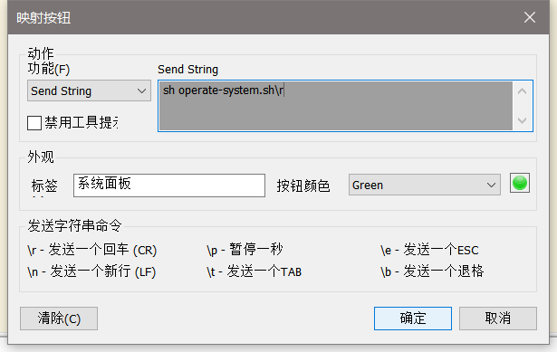

# life-management  自我管理系统

> 作者：jerry

## 项目简介
本项目包含db、报表、页面，支持任务管理、学习管理、生活记录等功能，可灵活扩展，一键部署。为了降低系统的复杂性，所以只采用了shell+html+nginx实现，不包含任何的mysql，springboot，tomcat等花里胡哨的东西(其实是俺不懂~)


github地址：<https://github.com/skyinfant/life-management>     
csdn：<https://blog.csdn.net/jerry_kim123/article/details/130071056>     
实例演示：<http://47.108.253.93/>              (按数字键1、2、3、4、5会跳转到其他5个页面)


🙏🏻 大家喜欢这个项目的话，感谢动手点点 star。

## 技术及设备要求
1、部署和使用本项目需要会基本的shell语言基础

2、需要一台拥有公网IP的linux服务器

3、需要懂一点点的nginx


## 功能特性

### 任务管理
```
支持任务的新建、暂停、开启、终止
```

### 睡眠管理/运动管理/阅读管理
```
点点按钮，就能记录自己每日的睡眠状况、运动状况、能量状态等，自动进行多维度统计，形成月度报表、年度报表，和echars动态页面
```

### 多页面展示
```
1. 每日页面(index.html)：展示最近30天的数据
2. 当月页面(monSum.html)：展示当月的汇总数据（在其他页面按数字键1即可跳转）
3. 当年页面(yearSum.html)：展示当年的汇总数据（在其他页面按数字键2即可跳转）
4. 汇总页面(sum.html)：展示全部汇总数据   （在其他页面按数字键3即可跳转）
5. 月度页面(mons.html)：展示最近24个月的数据 （在其他页面按数字键4即可跳转）
6. 年度页面(years.html)：展示历年数据 （在其他页面按数字键5即可跳转）
   
   在每个页面按Enter键播放背景音乐，再按一次暂停
   要使用这些页面，需要先配置nginx和 config/config.sh 这个文件
```

### 报表
```
自动形成月度报表、年度报表
```
### 日志记录
```
保存每日的生活日志
```
### 灵活扩展
```
可根据自己的需要快速增删参数(字段)，增删后会自动同步到db，报表和页面
```

## 各个文件及文件夹介绍

### life-management.sh
```
本项目的命令行展示界面
```

### data/params.sh
```
本项目的参数文件，系统的全部参数字段都定义在这个文件中，充当临时数据缓存的作用，最终数据储存在db文件中
```

### funcs.sh
```
存放项目用到的自定义方法
```

###  config/config.sh
```
本项目的配置文件，在里面可配置6个页面的访问url，背景音乐，以及月度页面和年度页面的开关，展示数据，颜色
```

### initParams.sh
```
用于进行每日数据初始化
```

### operate-system.sh
```
项目系统操作面板，增删参数、任务管理、初始化系统等都在这里操作
```

### data/db/
```
存放db文件
```

### data/note/
```
存放日志文件
```

### data/statement/
```
存放报表文件
```

## 快速部署

1. 在linux主机上 `git clone git@github.com:skyinfant/life-management.git`    把项目拉下来，或者直接下载项目压缩包解压
2. 进入life-management目录，执行 `sh operate-system.sh` ，选择第6个选项进行系统初始化，在询问是否允许加入crontab定时任务时输入y同意即可，然后等待1分钟初始化完成
3. 初始化完成后，返回操作面板，选择第5个选项，可以设置任务，按提示操作即可
4. 在操作面板按q退出，会自动回到本项目的主界面，如下图就部署完成了：



5. 配置nginx:   
本文使用docker来部署nginx。
docker安装nginx：https://cloud.tencent.com/developer/article/2015581         
注意，一定要把nginx容器的html目录，挂载到本项目的html目录，比如我的项目放在`/root/test` 下，
所以我的创建容器命令为 :


```
docker run -p 80:80 --name management \
-v /root/test/nginx/conf/nginx.conf:/etc/nginx/nginx.conf \
-v /root/test/nginx/conf/conf.d:/etc/nginx/conf.d \
-v /root/test/nginx/log:/var/log/nginx \
-v /root/test/life-management/html:/usr/share/nginx/html \
-d nginx:latest
```
nginx安装好后，编辑映射到宿主机的default.conf（我的位置是 `/root/test/nginx/conf/conf.d/default.conf`），这个是nginx的配置文件，在设置主页的地方加入这2行代码，以避免页面缓存：

```
add_header Cache-Control "no-cache, no-store";
expires 1s;
```


编辑完成后记得 `docker restart nginx容器名称` 重启nginx容器。

因为我把端口设为80，所以只要把`config/config.sh`  中的 `management_page_url` 设为我的服务器ip即可


    
等项目初始化完成，就可以用这个ip访问主页了




## 简单使用

1. `sh goodSleep.sh` 用于记录好的睡眠状况，`sh badSleep.sh`用于记录不好的睡眠状况，每日要先记录睡眠状况才能进行其他操作(根治熬夜顽疾~)
2. `sh focus_on_out.sh` 用于开启/关闭专注模式，再运行一次则退出专注模式
3. `sh completed_task.sh` 用于记录完成了1个任务，总任务量会减1
4. `sh operate-1.sh` 日常操作面板，可进行运动，读书等情况的记录，如果自己想扩充操作选项，只需要 `sh operate-system.sh`,在系统操作面板中增加参数(即是字段)，然后把自己的参数加入`operate-1.sh` 中的操作选项即可，代码十分简单，一看就懂。如果选项很多，那就复制多几个 `operate-2.sh`、`operate-3.sh`


## 贴心服务
1. 项目使用过程中有任何问题，欢迎随时提问，看到的话我会及时回复的
2. 执行 `export PS1=""` 可以隐藏当前会话窗口的命令行提示符，让主界面更清爽
3. 推荐使用`secureCRT`作为linux连接工具，因为它可以把常用命令设置成按钮，只要点一下按钮就可以执行脚本了。           
secureCRT8.5绿色版网盘链接：https://pan.baidu.com/s/1RbId4G1yWVGY1l49du9fGA?pwd=1234 

压缩包中有安装方法。secureCrt安装好后在顶栏右键，勾上这2个选项，可以显示command window和按钮栏




在下面的按钮栏上右键-新建按钮




填入内容，点确定即可新建一个按钮




## 项目初衷
>
时间过得太快了，常常感觉昨天还是26，今天就变18了，虚度时光，却一无所成。岁月不饶人，我也不能饶了岁月。既然留不住时间，那就留下自己走过的足迹吧。用程序记录下自己每一天，每个月，每一年的收获与成长，欢欣与遗憾。等到自己80岁时(但愿能活到那时候)，回首过往，此生多少事，都付代码中，哈哈哈
